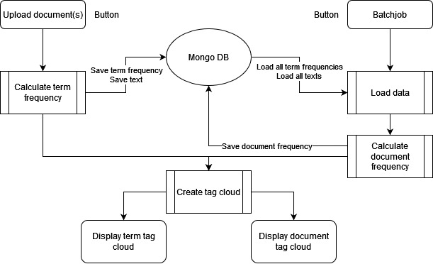

# Big Data Engineering and Analytics Project

This repository contains the source code for an exercise in the field of Big Data Engineering and Analytics as part of the Master of Computer Science, SS2024.

## Project Goal
The goal of this project is to develop a small web application based on the Lambda Architecture for analyzing large document collections. This application will include functionalities such as generating Tag Clouds using the TF-IDF method, uploading text files via a web interface, storing them in the file system (typically HDFS in practice), and performing batch processing tasks.

## Key Features
- **Upload of Text Files:** Users can upload text files through a web interface. Optionally, support for additional file types can be added.
- **Tag Cloud Generation:** Upon uploading a file, a Tag Cloud will be generated using the TF-IDF method. Stopwords (words with less than 4 characters) will be removed. Term frequency (TF) will be derived directly from the document.
- **Batch Job for Document Frequency (DF):** A batch job will calculate the Document Frequency (DF) of each word and store it in a database. If the batch hasn't run yet, the DF will be set to 1.
- **Selection and Display of Tag Clouds:** Users can select a file from a list of uploaded files and view its corresponding Tag Cloud in the browser.
- **Batch:** Users can manually trigger a batch job process using Hadoop or Spark. This batch will determine the document frequencies of words and store them in the database. Additionally, it will recalculate the Tag Clouds for each document.
- **Global TF-Sum Tag Cloud:** A Tag Cloud based on the global TF sum through document frequency will be generated.

## Technologies Used
- Flask (for web functionalities)
- Apache Spark (for batch processing)
- Mongo DB Database (for storing document frequencies and other relevant data)

## Installation Guide
Follow these steps to set up the environment:
1. Install Java JDK: [Download here](https://www.oracle.com/java/technologies/downloads/#jdk22-windows)
2. Install Hadoop (3.3.5): [Download here](https://hadoop.apache.org/release/3.3.5.html)
3. Install Apache Spark (3.5.1): [Download here](https://www.apache.org/dyn/closer.lua/spark/spark-3.5.1/spark-3.5.1-bin-hadoop3.tgz)
4. Install all required dependencies (requirements.txt)

### For Windows Users
5. Download the Hadoop binary corresponding to the version you installed from [this repository](https://github.com/cdarlint/winutils/tree/master).
6. Replace the original `bin` folder in your Hadoop installation directory with the `bin` folder you downloaded from the repository above.

Please ensure to follow these steps in order to avoid any configuration issues.

## Instructions for Running the Project
1. Clone this repository to your local machine.
2. Install the required dependencies.
3. Open the `flask_app.py` file and update the `path_to_python` and `path_to_hadoop` variables with the correct paths to your Python and Hadoop installations, respectively.
4. Run the Flask application `flask_app.py`.
5. Navigate to the web interface (http://localhost:5000) and start using the application.
6. End application by pressing `Ctrl + C`.

## Contributors
- Karel Kouambeng Fosso (karel.kouambengfosso@stud.hs-mannheim.de)
- Felix Mucha (felixjanmichael.mucha@stud.hs-mannheim.de)

## License
This project is licensed under the [GNU General Public License].
